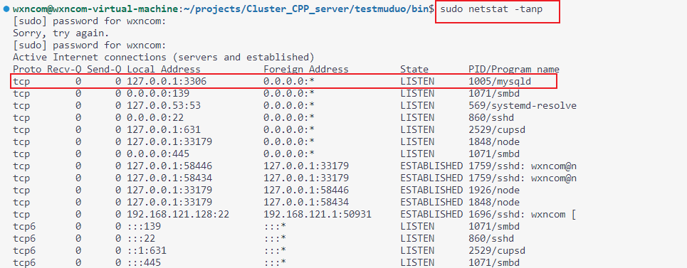
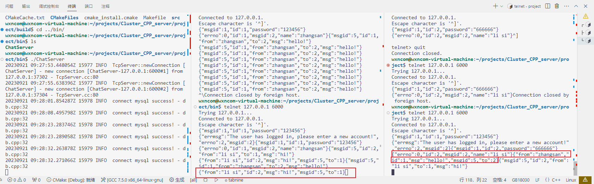

[TOC]


# 项目名:实现集群服务器

<font color=orange></font>

# 技术栈

- Json序列化和反序列化
- muduo网络库开发
- nginx源码编译安装和环境部署
- nginx的tcp负载均衡(也叫反向代理)器配置
- redis缓存服务器编程实践
- 基于发布-订阅的服务器中间件redis消息队列编程实践
- MySQL数据库编程
- CMake构建编译环境
- Github托管项目

# 通过这项目你学到(或者复习到)

- linux cpp
- Json数据协议
- moduo库（<font color=red>这个是我学习这个的主要目的之一</font>）
- nginx服务器的使用（<font color=red>这个是我学习这个的主要目的之一</font>）
- mysql
- cmake

# 实现功能

- 客户端注册登录
- 加好友,加群
- 好友聊天
- 群聊天

- 其他,待添加...

# 编码环境

linux+vscode

# json环境

使用一个第三节库：

[https://github.com/nlohmann/json/releases/download/v3.6.1/json.hpp](https://github.com/nlohmann/json/releases/download/v3.6.1/json.hpp）)

整个库文件只有一个json.hpp组成，使用json和使用stl一样简单

<font color=orange>请看testjson文件夹</font>

# muduo库+boost库

参考如下博客进行集成开发：

https://blog.csdn.net/QIANGWEIYUAN/article/details/89023980

<font color=orange>请看testmuduo文件夹</font>

本质：muduo本身就是epoll+多线程


# MySql数据库

## 登录mysql：

`mysql -u root -proot`

## 查看mysql服务开启了没有？



## mysql的服务器及开发包

`sudo apt-get install mysql-server =》 安装最新版MySQL服务器`		
		`sudo apt-get install libmysqlclient-dev =》 安装开发包`

## 库chat，表 allgroup  friend  groupuser offlinemessage user 

```mysql
mysql> show databases;
+--------------------+
| Database           |
+--------------------+
| information_schema |
| mysql              |
| performance_schema |
| shared_bike        |
| sys                |
| webserver          |
+--------------------+
6 rows in set (0.27 sec)

mysql> create database chat;
Query OK, 1 row affected (0.11 sec)
mysql> show databases;
+--------------------+
| Database           |
+--------------------+
| information_schema |
| chat               |
| mysql              |
| performance_schema |
| shared_bike        |
| sys                |
| webserver          |
+--------------------+
7 rows in set (0.00 sec)

mysql> use chat;
Database changed
mysql> CREATE TABLE `allgroup` (
    ->   `id` int(11) NOT NULL AUTO_INCREMENT,
    ->   `groupname` varchar(50) CHARACTER SET latin1 NOT NULL,
    ->   `groupdesc` varchar(200) CHARACTER SET latin1 DEFAULT '',
    ->   PRIMARY KEY (`id`),
    ->   UNIQUE KEY `groupname` (`groupname`)
    -> ) ENGINE=InnoDB AUTO_INCREMENT=2 DEFAULT CHARSET=utf8;
Query OK, 0 rows affected (0.68 sec)

mysql> show tables;
+----------------+
| Tables_in_chat |
+----------------+
| allgroup       |
+----------------+
1 row in set (0.00 sec)
mysql> CREATE TABLE `friend` (
    ->   `userid` int(11) NOT NULL,
    ->   `friendid` int(11) NOT NULL,
    ->   KEY `userid` (`userid`,`friendid`)
    -> ) ENGINE=InnoDB DEFAULT CHARSET=utf8;
Query OK, 0 rows affected (0.11 sec)

mysql> CREATE TABLE `groupuser` (
    ->   `groupid` int(11) NOT NULL,
    ->   `userid` int(11) NOT NULL,
    ->   `grouprole` enum('creator','normal') CHARACTER SET latin1 DEFAULT NULL,
    ->   KEY `groupid` (`groupid`,`userid`)
    -> ) ENGINE=InnoDB DEFAULT CHARSET=utf8;
Query OK, 0 rows affected (0.13 sec)

mysql> CREATE TABLE `offlinemessage` (
    ->   `userid` int(11) NOT NULL,
    ->   `message` varchar(500) NOT NULL
    -> ) ENGINE=InnoDB DEFAULT CHARSET=latin1;
Query OK, 0 rows affected (0.11 sec)

mysql> CREATE TABLE `user` (
    ->   `id` int(11) NOT NULL AUTO_INCREMENT,
    ->   `name` varchar(50) DEFAULT NULL,
    ->   `password` varchar(50) DEFAULT NULL,
    ->   `state` enum('online','offline') CHARACTER SET latin1 DEFAULT 'offline',
    ->   PRIMARY KEY (`id`),
    ->   UNIQUE KEY `name` (`name`)
    -> ) ENGINE=InnoDB AUTO_INCREMENT=22 DEFAULT CHARSET=utf8;
Query OK, 0 rows affected (0.01 sec)

mysql> show tables;
+----------------+
| Tables_in_chat |
+----------------+
| allgroup       |
| friend         |
| groupuser      |
| offlinemessage |
| user           |
+----------------+
5 rows in set (0.00 sec)

mysql> 
```

User表

字段名称 |字段类型 |字段说明 |约束
-------- | -----| -----| -----| -----| -----
id | INT |用户id| PRIMARY KEY、AUTO_INCREMENT
name| VARCHAR(50) |用户名| NOT NULL, UNIQUE
password| VARCHAR(50) |用户密码| NOT NULL
state |ENUM('online', 'offline') |当前登录状态| DEFAULT 'offline'

Friend表

字段名称 |字段类型 |字段说明 |约束
-------|-------|-------|-----
userid |INT |用户id| NOT NULL、联合主键
friendid| INT| 好友id |NOT NULL、联合主键

AllGroup表
字段名称 |字段类型 |字段说明 |约束
-------|-------|-------|-----
id| INT |组id| PRIMARY KEY、AUTO_INCREMENT
groupname| VARCHAR(50) |组名称 |NOT NULL,UNIQUE
groupdesc |VARCHAR(200) |组功能描述 |DEFAULT ''

GroupUser表

字段名称 |字段类型 |字段说明 |约束
-------|-------|-------|-----
groupid| INT |组id| NOT NULL、联合主键
userid |INT |组员id| NOT NULL、联合主键
grouprole| ENUM('creator', 'normal')| 组内角色| DEFAULT ‘normal’

OfflineMessage表

字段名称| 字段类型 |字段说明| 约束
-------|-------|-------|-----
userid| INT| 用户id |NOT NULL
message| VARCHAR(500) |离线消息（存储Json字符串） |NOT NULL

## 查看mysql动态库

```shell
sudo find /usr -name libmysqlclient*
```

# nginx配置tcp负载均衡

nginx在1.9版本之前，只支持http协议web服务器的负载均衡，

从1.9版本开始以后，nginx开始支持tcp的长连接负载均衡，但是nginx默认并没有编译tcp负载均衡模块，编写它时，需要加入--with-stream参数来激活这个模块。

>nginx编译加入--with-stream参数激活tcp负载均衡模块

nginx编译安装需要先安装pcre、openssl、zlib等库，也可以直接编译执行下面的configure命令，根
据错误提示信息，安装相应缺少的库。

下面的make命令会向系统路径拷贝文件，需要在root用户下执行
tony@tony-virtual-machine:~/package/nginx-1.12.2# ./configure --with-stream
tony@tony-virtual-machine:~/package/nginx-1.12.2# make && make install

编译完成后，默认安装在了/usr/local/nginx目录。
tony@tony-virtual-machine:~/package/nginx-1.12.2$ cd /usr/local/nginx/
tony@tony-virtual-machine:/usr/local/nginx$ ls
conf html logs sbin

可执行文件在sbin目录里面，配置文件在conf目录里面。


具体步骤可以看下面的内容:

(注:要想在nginx编译加入--with-stream参数激活tcp负载均衡模块,不能直接使用sudo apt-get install nginx,还需下载源码,比如1.12.2这个版本)

```shell
具体步骤:
wxncom@wxncom-virtual-machine:~/Nginx$ ls      ###################################
nginx-1.12.2.tar.gz
wxncom@wxncom-virtual-machine:~/Nginx$ tar -axvf nginx-1.12.2.tar.gz ###############
nginx-1.12.2/
nginx-1.12.2/auto/
nginx-1.12.2/conf/
nginx-1.12.2/contrib/
nginx-1.12.2/src/
nginx-1.12.2/configure
nginx-1.12.2/LICENSE
nginx-1.12.2/README
nginx-1.12.2/html/
nginx-1.12.2/man/
nginx-1.12.2/CHANGES.ru
nginx-1.12.2/CHANGES
nginx-1.12.2/man/nginx.8
nginx-1.12.2/html/50x.html
nginx-1.12.2/html/index.html
nginx-1.12.2/src/core/
nginx-1.12.2/src/event/
nginx-1.12.2/src/http/
nginx-1.12.2/src/mail/
nginx-1.12.2/src/misc/
nginx-1.12.2/src/os/
nginx-1.12.2/src/stream/
nginx-1.12.2/src/stream/ngx_stream_geo_module.c
nginx-1.12.2/src/stream/ngx_stream.c
nginx-1.12.2/src/stream/ngx_stream.h
nginx-1.12.2/src/stream/ngx_stream_limit_conn_module.c
nginx-1.12.2/src/stream/ngx_stream_access_module.c
nginx-1.12.2/src/stream/ngx_stream_core_module.c
nginx-1.12.2/src/stream/ngx_stream_geoip_module.c
nginx-1.12.2/src/stream/ngx_stream_handler.c
nginx-1.12.2/src/stream/ngx_stream_proxy_module.c
nginx-1.12.2/src/stream/ngx_stream_log_module.c
nginx-1.12.2/src/stream/ngx_stream_map_module.c
nginx-1.12.2/src/stream/ngx_stream_split_clients_module.c
nginx-1.12.2/src/stream/ngx_stream_realip_module.c
nginx-1.12.2/src/stream/ngx_stream_return_module.c
nginx-1.12.2/src/stream/ngx_stream_script.c
nginx-1.12.2/src/stream/ngx_stream_script.h
nginx-1.12.2/src/stream/ngx_stream_ssl_preread_module.c
nginx-1.12.2/src/stream/ngx_stream_ssl_module.c
nginx-1.12.2/src/stream/ngx_stream_ssl_module.h
nginx-1.12.2/src/stream/ngx_stream_upstream.c
nginx-1.12.2/src/stream/ngx_stream_upstream.h
nginx-1.12.2/src/stream/ngx_stream_upstream_least_conn_module.c
nginx-1.12.2/src/stream/ngx_stream_upstream_zone_module.c
nginx-1.12.2/src/stream/ngx_stream_upstream_hash_module.c
nginx-1.12.2/src/stream/ngx_stream_upstream_round_robin.c
nginx-1.12.2/src/stream/ngx_stream_upstream_round_robin.h
nginx-1.12.2/src/stream/ngx_stream_variables.c
nginx-1.12.2/src/stream/ngx_stream_variables.h
nginx-1.12.2/src/stream/ngx_stream_write_filter_module.c
nginx-1.12.2/src/os/unix/
nginx-1.12.2/src/os/unix/ngx_atomic.h
nginx-1.12.2/src/os/unix/ngx_alloc.c
nginx-1.12.2/src/os/unix/ngx_alloc.h
nginx-1.12.2/src/os/unix/ngx_darwin_config.h
nginx-1.12.2/src/os/unix/ngx_channel.c
nginx-1.12.2/src/os/unix/ngx_channel.h
nginx-1.12.2/src/os/unix/ngx_daemon.c
nginx-1.12.2/src/os/unix/ngx_darwin.h
nginx-1.12.2/src/os/unix/ngx_darwin_sendfile_chain.c
nginx-1.12.2/src/os/unix/ngx_darwin_init.c
nginx-1.12.2/src/os/unix/ngx_file_aio_read.c
nginx-1.12.2/src/os/unix/ngx_dlopen.c
nginx-1.12.2/src/os/unix/ngx_dlopen.h
nginx-1.12.2/src/os/unix/ngx_errno.c
nginx-1.12.2/src/os/unix/ngx_errno.h
nginx-1.12.2/src/os/unix/ngx_freebsd.h
nginx-1.12.2/src/os/unix/ngx_files.c
nginx-1.12.2/src/os/unix/ngx_files.h
nginx-1.12.2/src/os/unix/ngx_freebsd_sendfile_chain.c
nginx-1.12.2/src/os/unix/ngx_freebsd_config.h
nginx-1.12.2/src/os/unix/ngx_freebsd_init.c
nginx-1.12.2/src/os/unix/ngx_gcc_atomic_sparc64.h
nginx-1.12.2/src/os/unix/ngx_gcc_atomic_amd64.h
nginx-1.12.2/src/os/unix/ngx_gcc_atomic_ppc.h
nginx-1.12.2/src/os/unix/ngx_linux_sendfile_chain.c
nginx-1.12.2/src/os/unix/ngx_gcc_atomic_x86.h
nginx-1.12.2/src/os/unix/ngx_linux.h
nginx-1.12.2/src/os/unix/ngx_linux_aio_read.c
nginx-1.12.2/src/os/unix/ngx_linux_config.h
nginx-1.12.2/src/os/unix/ngx_linux_init.c
nginx-1.12.2/src/os/unix/ngx_posix_config.h
nginx-1.12.2/src/os/unix/ngx_os.h
nginx-1.12.2/src/os/unix/ngx_solaris_config.h
nginx-1.12.2/src/os/unix/ngx_posix_init.c
nginx-1.12.2/src/os/unix/ngx_process.c
nginx-1.12.2/src/os/unix/ngx_process.h
nginx-1.12.2/src/os/unix/ngx_process_cycle.c
nginx-1.12.2/src/os/unix/ngx_process_cycle.h
nginx-1.12.2/src/os/unix/ngx_readv_chain.c
nginx-1.12.2/src/os/unix/ngx_recv.c
nginx-1.12.2/src/os/unix/ngx_send.c
nginx-1.12.2/src/os/unix/ngx_setaffinity.c
nginx-1.12.2/src/os/unix/ngx_setaffinity.h
nginx-1.12.2/src/os/unix/ngx_setproctitle.c
nginx-1.12.2/src/os/unix/ngx_setproctitle.h
nginx-1.12.2/src/os/unix/ngx_shmem.c
nginx-1.12.2/src/os/unix/ngx_shmem.h
nginx-1.12.2/src/os/unix/ngx_socket.c
nginx-1.12.2/src/os/unix/ngx_socket.h
nginx-1.12.2/src/os/unix/ngx_solaris.h
nginx-1.12.2/src/os/unix/ngx_solaris_init.c
nginx-1.12.2/src/os/unix/ngx_sunpro_amd64.il
nginx-1.12.2/src/os/unix/ngx_thread_cond.c
nginx-1.12.2/src/os/unix/ngx_thread.h
nginx-1.12.2/src/os/unix/ngx_solaris_sendfilev_chain.c
nginx-1.12.2/src/os/unix/ngx_sunpro_atomic_sparc64.h
nginx-1.12.2/src/os/unix/ngx_sunpro_sparc64.il
nginx-1.12.2/src/os/unix/ngx_sunpro_x86.il
nginx-1.12.2/src/os/unix/ngx_thread_mutex.c
nginx-1.12.2/src/os/unix/ngx_thread_id.c
nginx-1.12.2/src/os/unix/ngx_udp_recv.c
nginx-1.12.2/src/os/unix/ngx_time.c
nginx-1.12.2/src/os/unix/ngx_time.h
nginx-1.12.2/src/os/unix/ngx_udp_sendmsg_chain.c
nginx-1.12.2/src/os/unix/ngx_udp_send.c
nginx-1.12.2/src/os/unix/ngx_writev_chain.c
nginx-1.12.2/src/os/unix/ngx_user.c
nginx-1.12.2/src/os/unix/ngx_user.h
nginx-1.12.2/src/misc/ngx_google_perftools_module.c
nginx-1.12.2/src/misc/ngx_cpp_test_module.cpp
nginx-1.12.2/src/mail/ngx_mail_handler.c
nginx-1.12.2/src/mail/ngx_mail.c
nginx-1.12.2/src/mail/ngx_mail.h
nginx-1.12.2/src/mail/ngx_mail_auth_http_module.c
nginx-1.12.2/src/mail/ngx_mail_core_module.c
nginx-1.12.2/src/mail/ngx_mail_imap_handler.c
nginx-1.12.2/src/mail/ngx_mail_imap_module.c
nginx-1.12.2/src/mail/ngx_mail_imap_module.h
nginx-1.12.2/src/mail/ngx_mail_parse.c
nginx-1.12.2/src/mail/ngx_mail_pop3_handler.c
nginx-1.12.2/src/mail/ngx_mail_pop3_module.c
nginx-1.12.2/src/mail/ngx_mail_pop3_module.h
nginx-1.12.2/src/mail/ngx_mail_proxy_module.c
nginx-1.12.2/src/mail/ngx_mail_smtp_handler.c
nginx-1.12.2/src/mail/ngx_mail_smtp_module.c
nginx-1.12.2/src/mail/ngx_mail_smtp_module.h
nginx-1.12.2/src/mail/ngx_mail_ssl_module.c
nginx-1.12.2/src/mail/ngx_mail_ssl_module.h
nginx-1.12.2/src/http/modules/
nginx-1.12.2/src/http/ngx_http_cache.h
nginx-1.12.2/src/http/ngx_http.c
nginx-1.12.2/src/http/ngx_http.h
nginx-1.12.2/src/http/ngx_http_core_module.c
nginx-1.12.2/src/http/ngx_http_config.h
nginx-1.12.2/src/http/ngx_http_postpone_filter_module.c
nginx-1.12.2/src/http/ngx_http_copy_filter_module.c
nginx-1.12.2/src/http/ngx_http_core_module.h
nginx-1.12.2/src/http/ngx_http_file_cache.c
nginx-1.12.2/src/http/ngx_http_header_filter_module.c
nginx-1.12.2/src/http/ngx_http_parse.c
nginx-1.12.2/src/http/ngx_http_special_response.c
nginx-1.12.2/src/http/ngx_http_request.c
nginx-1.12.2/src/http/ngx_http_request.h
nginx-1.12.2/src/http/ngx_http_request_body.c
nginx-1.12.2/src/http/ngx_http_script.c
nginx-1.12.2/src/http/ngx_http_script.h
nginx-1.12.2/src/http/ngx_http_variables.c
nginx-1.12.2/src/http/ngx_http_upstream.c
nginx-1.12.2/src/http/ngx_http_upstream.h
nginx-1.12.2/src/http/v2/
nginx-1.12.2/src/http/ngx_http_upstream_round_robin.c
nginx-1.12.2/src/http/ngx_http_upstream_round_robin.h
nginx-1.12.2/src/http/ngx_http_variables.h
nginx-1.12.2/src/http/ngx_http_write_filter_module.c
nginx-1.12.2/src/http/v2/ngx_http_v2_module.c
nginx-1.12.2/src/http/v2/ngx_http_v2.c
nginx-1.12.2/src/http/v2/ngx_http_v2.h
nginx-1.12.2/src/http/v2/ngx_http_v2_filter_module.c
nginx-1.12.2/src/http/v2/ngx_http_v2_huff_decode.c
nginx-1.12.2/src/http/v2/ngx_http_v2_huff_encode.c
nginx-1.12.2/src/http/v2/ngx_http_v2_module.h
nginx-1.12.2/src/http/v2/ngx_http_v2_table.c
nginx-1.12.2/src/http/modules/ngx_http_addition_filter_module.c
nginx-1.12.2/src/http/modules/ngx_http_access_module.c
nginx-1.12.2/src/http/modules/ngx_http_charset_filter_module.c
nginx-1.12.2/src/http/modules/ngx_http_auth_basic_module.c
nginx-1.12.2/src/http/modules/ngx_http_auth_request_module.c
nginx-1.12.2/src/http/modules/ngx_http_autoindex_module.c
nginx-1.12.2/src/http/modules/ngx_http_browser_module.c
nginx-1.12.2/src/http/modules/ngx_http_not_modified_filter_module.c
nginx-1.12.2/src/http/modules/ngx_http_chunked_filter_module.c
nginx-1.12.2/src/http/modules/ngx_http_dav_module.c
nginx-1.12.2/src/http/modules/ngx_http_degradation_module.c
nginx-1.12.2/src/http/modules/ngx_http_empty_gif_module.c
nginx-1.12.2/src/http/modules/ngx_http_fastcgi_module.c
nginx-1.12.2/src/http/modules/ngx_http_flv_module.c
nginx-1.12.2/src/http/modules/ngx_http_geo_module.c
nginx-1.12.2/src/http/modules/ngx_http_geoip_module.c
nginx-1.12.2/src/http/modules/ngx_http_gunzip_filter_module.c
nginx-1.12.2/src/http/modules/ngx_http_gzip_filter_module.c
nginx-1.12.2/src/http/modules/ngx_http_gzip_static_module.c
nginx-1.12.2/src/http/modules/ngx_http_headers_filter_module.c
nginx-1.12.2/src/http/modules/ngx_http_image_filter_module.c
nginx-1.12.2/src/http/modules/ngx_http_index_module.c
nginx-1.12.2/src/http/modules/ngx_http_limit_conn_module.c
nginx-1.12.2/src/http/modules/ngx_http_limit_req_module.c
nginx-1.12.2/src/http/modules/ngx_http_log_module.c
nginx-1.12.2/src/http/modules/ngx_http_map_module.c
nginx-1.12.2/src/http/modules/ngx_http_memcached_module.c
nginx-1.12.2/src/http/modules/ngx_http_mp4_module.c
nginx-1.12.2/src/http/modules/ngx_http_random_index_module.c
nginx-1.12.2/src/http/modules/ngx_http_proxy_module.c
nginx-1.12.2/src/http/modules/ngx_http_upstream_ip_hash_module.c
nginx-1.12.2/src/http/modules/ngx_http_range_filter_module.c
nginx-1.12.2/src/http/modules/ngx_http_realip_module.c
nginx-1.12.2/src/http/modules/ngx_http_referer_module.c
nginx-1.12.2/src/http/modules/ngx_http_rewrite_module.c
nginx-1.12.2/src/http/modules/ngx_http_scgi_module.c
nginx-1.12.2/src/http/modules/ngx_http_secure_link_module.c
nginx-1.12.2/src/http/modules/ngx_http_slice_filter_module.c
nginx-1.12.2/src/http/modules/ngx_http_split_clients_module.c
nginx-1.12.2/src/http/modules/perl/
nginx-1.12.2/src/http/modules/ngx_http_ssi_filter_module.c
nginx-1.12.2/src/http/modules/ngx_http_ssi_filter_module.h
nginx-1.12.2/src/http/modules/ngx_http_ssl_module.c
nginx-1.12.2/src/http/modules/ngx_http_ssl_module.h
nginx-1.12.2/src/http/modules/ngx_http_static_module.c
nginx-1.12.2/src/http/modules/ngx_http_stub_status_module.c
nginx-1.12.2/src/http/modules/ngx_http_sub_filter_module.c
nginx-1.12.2/src/http/modules/ngx_http_upstream_hash_module.c
nginx-1.12.2/src/http/modules/ngx_http_xslt_filter_module.c
nginx-1.12.2/src/http/modules/ngx_http_upstream_keepalive_module.c
nginx-1.12.2/src/http/modules/ngx_http_upstream_least_conn_module.c
nginx-1.12.2/src/http/modules/ngx_http_upstream_zone_module.c
nginx-1.12.2/src/http/modules/ngx_http_uwsgi_module.c
nginx-1.12.2/src/http/modules/ngx_http_userid_filter_module.c
nginx-1.12.2/src/http/modules/perl/Makefile.PL
nginx-1.12.2/src/http/modules/perl/nginx.pm
nginx-1.12.2/src/http/modules/perl/nginx.xs
nginx-1.12.2/src/http/modules/perl/typemap
nginx-1.12.2/src/http/modules/perl/ngx_http_perl_module.c
nginx-1.12.2/src/http/modules/perl/ngx_http_perl_module.h
nginx-1.12.2/src/event/modules/
nginx-1.12.2/src/event/ngx_event_accept.c
nginx-1.12.2/src/event/ngx_event.c
nginx-1.12.2/src/event/ngx_event.h
nginx-1.12.2/src/event/ngx_event_openssl_stapling.c
nginx-1.12.2/src/event/ngx_event_connect.c
nginx-1.12.2/src/event/ngx_event_connect.h
nginx-1.12.2/src/event/ngx_event_openssl.c
nginx-1.12.2/src/event/ngx_event_openssl.h
nginx-1.12.2/src/event/ngx_event_pipe.c
nginx-1.12.2/src/event/ngx_event_pipe.h
nginx-1.12.2/src/event/ngx_event_posted.c
nginx-1.12.2/src/event/ngx_event_posted.h
nginx-1.12.2/src/event/ngx_event_timer.c
nginx-1.12.2/src/event/ngx_event_timer.h
nginx-1.12.2/src/event/modules/ngx_win32_select_module.c
nginx-1.12.2/src/event/modules/ngx_devpoll_module.c
nginx-1.12.2/src/event/modules/ngx_epoll_module.c
nginx-1.12.2/src/event/modules/ngx_eventport_module.c
nginx-1.12.2/src/event/modules/ngx_kqueue_module.c
nginx-1.12.2/src/event/modules/ngx_poll_module.c
nginx-1.12.2/src/event/modules/ngx_select_module.c
nginx-1.12.2/src/core/ngx_array.c
nginx-1.12.2/src/core/nginx.c
nginx-1.12.2/src/core/nginx.h
nginx-1.12.2/src/core/ngx_conf_file.c
nginx-1.12.2/src/core/ngx_array.h
nginx-1.12.2/src/core/ngx_buf.c
nginx-1.12.2/src/core/ngx_buf.h
nginx-1.12.2/src/core/ngx_connection.c
nginx-1.12.2/src/core/ngx_conf_file.h
nginx-1.12.2/src/core/ngx_config.h
nginx-1.12.2/src/core/ngx_module.c
nginx-1.12.2/src/core/ngx_file.c
nginx-1.12.2/src/core/ngx_connection.h
nginx-1.12.2/src/core/ngx_core.h
nginx-1.12.2/src/core/ngx_cpuinfo.c
nginx-1.12.2/src/core/ngx_crc.h
nginx-1.12.2/src/core/ngx_crc32.c
nginx-1.12.2/src/core/ngx_crc32.h
nginx-1.12.2/src/core/ngx_crypt.c
nginx-1.12.2/src/core/ngx_crypt.h
nginx-1.12.2/src/core/ngx_cycle.c
nginx-1.12.2/src/core/ngx_cycle.h
nginx-1.12.2/src/core/ngx_parse.h
nginx-1.12.2/src/core/ngx_file.h
nginx-1.12.2/src/core/ngx_hash.c
nginx-1.12.2/src/core/ngx_hash.h
nginx-1.12.2/src/core/ngx_inet.c
nginx-1.12.2/src/core/ngx_inet.h
nginx-1.12.2/src/core/ngx_list.c
nginx-1.12.2/src/core/ngx_list.h
nginx-1.12.2/src/core/ngx_log.c
nginx-1.12.2/src/core/ngx_log.h
nginx-1.12.2/src/core/ngx_md5.c
nginx-1.12.2/src/core/ngx_md5.h
nginx-1.12.2/src/core/ngx_murmurhash.c
nginx-1.12.2/src/core/ngx_module.h
nginx-1.12.2/src/core/ngx_open_file_cache.c
nginx-1.12.2/src/core/ngx_murmurhash.h
nginx-1.12.2/src/core/ngx_slab.h
nginx-1.12.2/src/core/ngx_open_file_cache.h
nginx-1.12.2/src/core/ngx_output_chain.c
nginx-1.12.2/src/core/ngx_palloc.c
nginx-1.12.2/src/core/ngx_palloc.h
nginx-1.12.2/src/core/ngx_parse.c
nginx-1.12.2/src/core/ngx_thread_pool.c
nginx-1.12.2/src/core/ngx_parse_time.c
nginx-1.12.2/src/core/ngx_parse_time.h
nginx-1.12.2/src/core/ngx_proxy_protocol.c
nginx-1.12.2/src/core/ngx_proxy_protocol.h
nginx-1.12.2/src/core/ngx_queue.c
nginx-1.12.2/src/core/ngx_queue.h
nginx-1.12.2/src/core/ngx_radix_tree.c
nginx-1.12.2/src/core/ngx_radix_tree.h
nginx-1.12.2/src/core/ngx_rbtree.c
nginx-1.12.2/src/core/ngx_rbtree.h
nginx-1.12.2/src/core/ngx_regex.c
nginx-1.12.2/src/core/ngx_regex.h
nginx-1.12.2/src/core/ngx_resolver.c
nginx-1.12.2/src/core/ngx_resolver.h
nginx-1.12.2/src/core/ngx_rwlock.c
nginx-1.12.2/src/core/ngx_rwlock.h
nginx-1.12.2/src/core/ngx_sha1.c
nginx-1.12.2/src/core/ngx_sha1.h
nginx-1.12.2/src/core/ngx_shmtx.c
nginx-1.12.2/src/core/ngx_shmtx.h
nginx-1.12.2/src/core/ngx_slab.c
nginx-1.12.2/src/core/ngx_spinlock.c
nginx-1.12.2/src/core/ngx_string.c
nginx-1.12.2/src/core/ngx_string.h
nginx-1.12.2/src/core/ngx_syslog.c
nginx-1.12.2/src/core/ngx_syslog.h
nginx-1.12.2/src/core/ngx_thread_pool.h
nginx-1.12.2/src/core/ngx_times.c
nginx-1.12.2/src/core/ngx_times.h
nginx-1.12.2/contrib/geo2nginx.pl
nginx-1.12.2/contrib/README
nginx-1.12.2/contrib/unicode2nginx/
nginx-1.12.2/contrib/vim/
nginx-1.12.2/contrib/vim/ftdetect/
nginx-1.12.2/contrib/vim/ftplugin/
nginx-1.12.2/contrib/vim/indent/
nginx-1.12.2/contrib/vim/syntax/
nginx-1.12.2/contrib/vim/syntax/nginx.vim
nginx-1.12.2/contrib/vim/indent/nginx.vim
nginx-1.12.2/contrib/vim/ftplugin/nginx.vim
nginx-1.12.2/contrib/vim/ftdetect/nginx.vim
nginx-1.12.2/contrib/unicode2nginx/koi-utf
nginx-1.12.2/contrib/unicode2nginx/win-utf
nginx-1.12.2/contrib/unicode2nginx/unicode-to-nginx.pl
nginx-1.12.2/conf/fastcgi.conf
nginx-1.12.2/conf/fastcgi_params
nginx-1.12.2/conf/koi-utf
nginx-1.12.2/conf/koi-win
nginx-1.12.2/conf/mime.types
nginx-1.12.2/conf/nginx.conf
nginx-1.12.2/conf/scgi_params
nginx-1.12.2/conf/uwsgi_params
nginx-1.12.2/conf/win-utf
nginx-1.12.2/auto/cc/
nginx-1.12.2/auto/have_headers
nginx-1.12.2/auto/define
nginx-1.12.2/auto/endianness
nginx-1.12.2/auto/feature
nginx-1.12.2/auto/have
nginx-1.12.2/auto/lib/
nginx-1.12.2/auto/os/
nginx-1.12.2/auto/headers
nginx-1.12.2/auto/include
nginx-1.12.2/auto/init
nginx-1.12.2/auto/install
nginx-1.12.2/auto/types/
nginx-1.12.2/auto/make
nginx-1.12.2/auto/module
nginx-1.12.2/auto/modules
nginx-1.12.2/auto/nohave
nginx-1.12.2/auto/options
nginx-1.12.2/auto/sources
nginx-1.12.2/auto/stubs
nginx-1.12.2/auto/summary
nginx-1.12.2/auto/threads
nginx-1.12.2/auto/unix
nginx-1.12.2/auto/types/uintptr_t
nginx-1.12.2/auto/types/sizeof
nginx-1.12.2/auto/types/typedef
nginx-1.12.2/auto/types/value
nginx-1.12.2/auto/os/conf
nginx-1.12.2/auto/os/darwin
nginx-1.12.2/auto/os/freebsd
nginx-1.12.2/auto/os/linux
nginx-1.12.2/auto/os/solaris
nginx-1.12.2/auto/os/win32
nginx-1.12.2/auto/lib/geoip/
nginx-1.12.2/auto/lib/conf
nginx-1.12.2/auto/lib/google-perftools/
nginx-1.12.2/auto/lib/libatomic/
nginx-1.12.2/auto/lib/libgd/
nginx-1.12.2/auto/lib/libxslt/
nginx-1.12.2/auto/lib/openssl/
nginx-1.12.2/auto/lib/make
nginx-1.12.2/auto/lib/pcre/
nginx-1.12.2/auto/lib/perl/
nginx-1.12.2/auto/lib/zlib/
nginx-1.12.2/auto/lib/zlib/makefile.bcc
nginx-1.12.2/auto/lib/zlib/conf
nginx-1.12.2/auto/lib/zlib/make
nginx-1.12.2/auto/lib/zlib/makefile.msvc
nginx-1.12.2/auto/lib/zlib/makefile.owc
nginx-1.12.2/auto/lib/perl/conf
nginx-1.12.2/auto/lib/perl/make
nginx-1.12.2/auto/lib/pcre/makefile.bcc
nginx-1.12.2/auto/lib/pcre/conf
nginx-1.12.2/auto/lib/pcre/make
nginx-1.12.2/auto/lib/pcre/makefile.msvc
nginx-1.12.2/auto/lib/pcre/makefile.owc
nginx-1.12.2/auto/lib/openssl/makefile.bcc
nginx-1.12.2/auto/lib/openssl/conf
nginx-1.12.2/auto/lib/openssl/make
nginx-1.12.2/auto/lib/openssl/makefile.msvc
nginx-1.12.2/auto/lib/libxslt/conf
nginx-1.12.2/auto/lib/libgd/conf
nginx-1.12.2/auto/lib/libatomic/conf
nginx-1.12.2/auto/lib/libatomic/make
nginx-1.12.2/auto/lib/google-perftools/conf
nginx-1.12.2/auto/lib/geoip/conf
nginx-1.12.2/auto/cc/clang
nginx-1.12.2/auto/cc/acc
nginx-1.12.2/auto/cc/bcc
nginx-1.12.2/auto/cc/ccc
nginx-1.12.2/auto/cc/conf
nginx-1.12.2/auto/cc/gcc
nginx-1.12.2/auto/cc/icc
nginx-1.12.2/auto/cc/msvc
nginx-1.12.2/auto/cc/name
nginx-1.12.2/auto/cc/owc
nginx-1.12.2/auto/cc/sunc
wxncom@wxncom-virtual-machine:~/Nginx$ ls  ################################
nginx-1.12.2  nginx-1.12.2.tar.gz
wxncom@wxncom-virtual-machine:~/Nginx$ cd nginx-1.12.2/    ##################
wxncom@wxncom-virtual-machine:~/Nginx/nginx-1.12.2$ ls     #################
auto  CHANGES  CHANGES.ru  conf  configure  contrib  html  LICENSE  man  README  src
wxncom@wxncom-virtual-machine:~/Nginx/nginx-1.12.2$ ./configure --with-stream  ########
checking for OS
 + Linux 4.15.0-213-generic x86_64
checking for C compiler ... found
 + using GNU C compiler
 + gcc version: 7.5.0 (Ubuntu 7.5.0-3ubuntu1~18.04) 
checking for gcc -pipe switch ... found
checking for -Wl,-E switch ... found
checking for gcc builtin atomic operations ... found
checking for C99 variadic macros ... found
checking for gcc variadic macros ... found
checking for gcc builtin 64 bit byteswap ... found
checking for unistd.h ... found
checking for inttypes.h ... found
checking for limits.h ... found
checking for sys/filio.h ... not found
checking for sys/param.h ... found
checking for sys/mount.h ... found
checking for sys/statvfs.h ... found
checking for crypt.h ... found
checking for Linux specific features
checking for epoll ... found
checking for EPOLLRDHUP ... found
checking for EPOLLEXCLUSIVE ... found
checking for O_PATH ... found
checking for sendfile() ... found
checking for sendfile64() ... found
checking for sys/prctl.h ... found
checking for prctl(PR_SET_DUMPABLE) ... found
checking for sched_setaffinity() ... found
checking for crypt_r() ... found
checking for sys/vfs.h ... found
checking for nobody group ... not found
checking for nogroup group ... found
checking for poll() ... found
checking for /dev/poll ... not found
checking for kqueue ... not found
checking for crypt() ... not found
checking for crypt() in libcrypt ... found
checking for F_READAHEAD ... not found
checking for posix_fadvise() ... found
checking for O_DIRECT ... found
checking for F_NOCACHE ... not found
checking for directio() ... not found
checking for statfs() ... found
checking for statvfs() ... found
checking for dlopen() ... not found
checking for dlopen() in libdl ... found
checking for sched_yield() ... found
checking for SO_SETFIB ... not found
checking for SO_REUSEPORT ... found
checking for SO_ACCEPTFILTER ... not found
checking for SO_BINDANY ... not found
checking for IP_BIND_ADDRESS_NO_PORT ... found
checking for IP_TRANSPARENT ... found
checking for IP_BINDANY ... not found
checking for IP_RECVDSTADDR ... not found
checking for IP_PKTINFO ... found
checking for IPV6_RECVPKTINFO ... found
checking for TCP_DEFER_ACCEPT ... found
checking for TCP_KEEPIDLE ... found
checking for TCP_FASTOPEN ... found
checking for TCP_INFO ... found
checking for accept4() ... found
checking for eventfd() ... found
checking for int size ... 4 bytes
checking for long size ... 8 bytes
checking for long long size ... 8 bytes
checking for void * size ... 8 bytes
checking for uint32_t ... found
checking for uint64_t ... found
checking for sig_atomic_t ... found
checking for sig_atomic_t size ... 4 bytes
checking for socklen_t ... found
checking for in_addr_t ... found
checking for in_port_t ... found
checking for rlim_t ... found
checking for uintptr_t ... uintptr_t found
checking for system byte ordering ... little endian
checking for size_t size ... 8 bytes
checking for off_t size ... 8 bytes
checking for time_t size ... 8 bytes
checking for AF_INET6 ... found
checking for setproctitle() ... not found
checking for pread() ... found
checking for pwrite() ... found
checking for pwritev() ... found
checking for sys_nerr ... found
checking for localtime_r() ... found
checking for posix_memalign() ... found
checking for memalign() ... found
checking for mmap(MAP_ANON|MAP_SHARED) ... found
checking for mmap("/dev/zero", MAP_SHARED) ... found
checking for System V shared memory ... found
checking for POSIX semaphores ... not found
checking for POSIX semaphores in libpthread ... found
checking for struct msghdr.msg_control ... found
checking for ioctl(FIONBIO) ... found
checking for struct tm.tm_gmtoff ... found
checking for struct dirent.d_namlen ... not found
checking for struct dirent.d_type ... found
checking for sysconf(_SC_NPROCESSORS_ONLN) ... found
checking for openat(), fstatat() ... found
checking for getaddrinfo() ... found
checking for PCRE library ... not found
checking for PCRE library in /usr/local/ ... not found
checking for PCRE library in /usr/include/pcre/ ... not found
checking for PCRE library in /usr/pkg/ ... not found
checking for PCRE library in /opt/local/ ... not found

./configure: error: the HTTP rewrite module requires the PCRE library.
You can either disable the module by using --without-http_rewrite_module
option, or install the PCRE library into the system, or build the PCRE library
statically from the source with nginx by using --with-pcre=<path> option.

wxncom@wxncom-virtual-machine:~/Nginx/nginx-1.12.2$ sudo apt-get install libpcre3 libpcre3-dev   #####################################
Reading package lists... Done
Building dependency tree       
Reading state information... Done
libpcre3 is already the newest version (2:8.39-9ubuntu0.1).
The following packages were automatically installed and are no longer required:
  libnginx-mod-http-geoip libnginx-mod-http-image-filter libnginx-mod-http-xslt-filter libnginx-mod-mail libnginx-mod-stream
  libprotobuf-lite10 nginx-common nginx-core
Use 'sudo apt autoremove' to remove them.
The following additional packages will be installed:
  libpcre16-3 libpcre32-3 libpcrecpp0v5
The following NEW packages will be installed:
  libpcre16-3 libpcre3-dev libpcre32-3 libpcrecpp0v5
0 upgraded, 4 newly installed, 0 to remove and 42 not upgraded.
Need to get 837 kB of archives.
After this operation, 3,566 kB of additional disk space will be used.
Do you want to continue? [Y/n] y
Get:1 http://mirrors.tuna.tsinghua.edu.cn/ubuntu bionic-updates/main amd64 libpcre16-3 amd64 2:8.39-9ubuntu0.1 [147 kB]
Get:2 http://mirrors.tuna.tsinghua.edu.cn/ubuntu bionic-updates/main amd64 libpcre32-3 amd64 2:8.39-9ubuntu0.1 [138 kB]
Get:3 http://mirrors.tuna.tsinghua.edu.cn/ubuntu bionic-updates/main amd64 libpcrecpp0v5 amd64 2:8.39-9ubuntu0.1 [15.3 kB]
Get:4 http://mirrors.tuna.tsinghua.edu.cn/ubuntu bionic-updates/main amd64 libpcre3-dev amd64 2:8.39-9ubuntu0.1 [536 kB]
Fetched 837 kB in 1s (638 kB/s)       
Selecting previously unselected package libpcre16-3:amd64.
(Reading database ... 181653 files and directories currently installed.)
Preparing to unpack .../libpcre16-3_2%3a8.39-9ubuntu0.1_amd64.deb ...
Unpacking libpcre16-3:amd64 (2:8.39-9ubuntu0.1) ...
Selecting previously unselected package libpcre32-3:amd64.
Preparing to unpack .../libpcre32-3_2%3a8.39-9ubuntu0.1_amd64.deb ...
Unpacking libpcre32-3:amd64 (2:8.39-9ubuntu0.1) ...
Selecting previously unselected package libpcrecpp0v5:amd64.
Preparing to unpack .../libpcrecpp0v5_2%3a8.39-9ubuntu0.1_amd64.deb ...
Unpacking libpcrecpp0v5:amd64 (2:8.39-9ubuntu0.1) ...
Selecting previously unselected package libpcre3-dev:amd64.
Preparing to unpack .../libpcre3-dev_2%3a8.39-9ubuntu0.1_amd64.deb ...
Unpacking libpcre3-dev:amd64 (2:8.39-9ubuntu0.1) ...
Setting up libpcrecpp0v5:amd64 (2:8.39-9ubuntu0.1) ...
Setting up libpcre32-3:amd64 (2:8.39-9ubuntu0.1) ...
Setting up libpcre16-3:amd64 (2:8.39-9ubuntu0.1) ...
Setting up libpcre3-dev:amd64 (2:8.39-9ubuntu0.1) ...
Processing triggers for man-db (2.8.3-2ubuntu0.1) ...
Processing triggers for libc-bin (2.27-3ubuntu1.5) ...
wxncom@wxncom-virtual-machine:~/Nginx/nginx-1.12.2$ ./configure --with-stream
checking for OS
 + Linux 4.15.0-213-generic x86_64
checking for C compiler ... found
 + using GNU C compiler
 + gcc version: 7.5.0 (Ubuntu 7.5.0-3ubuntu1~18.04) 
checking for gcc -pipe switch ... found
checking for -Wl,-E switch ... found
checking for gcc builtin atomic operations ... found
checking for C99 variadic macros ... found
checking for gcc variadic macros ... found
checking for gcc builtin 64 bit byteswap ... found
checking for unistd.h ... found
checking for inttypes.h ... found
checking for limits.h ... found
checking for sys/filio.h ... not found
checking for sys/param.h ... found
checking for sys/mount.h ... found
checking for sys/statvfs.h ... found
checking for crypt.h ... found
checking for Linux specific features
checking for epoll ... found
checking for EPOLLRDHUP ... found
checking for EPOLLEXCLUSIVE ... found
checking for O_PATH ... found
checking for sendfile() ... found
checking for sendfile64() ... found
checking for sys/prctl.h ... found
checking for prctl(PR_SET_DUMPABLE) ... found
checking for sched_setaffinity() ... found
checking for crypt_r() ... found
checking for sys/vfs.h ... found
checking for nobody group ... not found
checking for nogroup group ... found
checking for poll() ... found
checking for /dev/poll ... not found
checking for kqueue ... not found
checking for crypt() ... not found
checking for crypt() in libcrypt ... found
checking for F_READAHEAD ... not found
checking for posix_fadvise() ... found
checking for O_DIRECT ... found
checking for F_NOCACHE ... not found
checking for directio() ... not found
checking for statfs() ... found
checking for statvfs() ... found
checking for dlopen() ... not found
checking for dlopen() in libdl ... found
checking for sched_yield() ... found
checking for SO_SETFIB ... not found
checking for SO_REUSEPORT ... found
checking for SO_ACCEPTFILTER ... not found
checking for SO_BINDANY ... not found
checking for IP_BIND_ADDRESS_NO_PORT ... found
checking for IP_TRANSPARENT ... found
checking for IP_BINDANY ... not found
checking for IP_RECVDSTADDR ... not found
checking for IP_PKTINFO ... found
checking for IPV6_RECVPKTINFO ... found
checking for TCP_DEFER_ACCEPT ... found
checking for TCP_KEEPIDLE ... found
checking for TCP_FASTOPEN ... found
checking for TCP_INFO ... found
checking for accept4() ... found
checking for eventfd() ... found
checking for int size ... 4 bytes
checking for long size ... 8 bytes
checking for long long size ... 8 bytes
checking for void * size ... 8 bytes
checking for uint32_t ... found
checking for uint64_t ... found
checking for sig_atomic_t ... found
checking for sig_atomic_t size ... 4 bytes
checking for socklen_t ... found
checking for in_addr_t ... found
checking for in_port_t ... found
checking for rlim_t ... found
checking for uintptr_t ... uintptr_t found
checking for system byte ordering ... little endian
checking for size_t size ... 8 bytes
checking for off_t size ... 8 bytes
checking for time_t size ... 8 bytes
checking for AF_INET6 ... found
checking for setproctitle() ... not found
checking for pread() ... found
checking for pwrite() ... found
checking for pwritev() ... found
checking for sys_nerr ... found
checking for localtime_r() ... found
checking for posix_memalign() ... found
checking for memalign() ... found
checking for mmap(MAP_ANON|MAP_SHARED) ... found
checking for mmap("/dev/zero", MAP_SHARED) ... found
checking for System V shared memory ... found
checking for POSIX semaphores ... not found
checking for POSIX semaphores in libpthread ... found
checking for struct msghdr.msg_control ... found
checking for ioctl(FIONBIO) ... found
checking for struct tm.tm_gmtoff ... found
checking for struct dirent.d_namlen ... not found
checking for struct dirent.d_type ... found
checking for sysconf(_SC_NPROCESSORS_ONLN) ... found
checking for openat(), fstatat() ... found
checking for getaddrinfo() ... found
checking for PCRE library ... found
checking for PCRE JIT support ... found
checking for zlib library ... found
creating objs/Makefile

Configuration summary
  + using system PCRE library
  + OpenSSL library is not used
  + using system zlib library

  nginx path prefix: "/usr/local/nginx"
  nginx binary file: "/usr/local/nginx/sbin/nginx"
  nginx modules path: "/usr/local/nginx/modules"
  nginx configuration prefix: "/usr/local/nginx/conf"
  nginx configuration file: "/usr/local/nginx/conf/nginx.conf"
  nginx pid file: "/usr/local/nginx/logs/nginx.pid"
  nginx error log file: "/usr/local/nginx/logs/error.log"
  nginx http access log file: "/usr/local/nginx/logs/access.log"
  nginx http client request body temporary files: "client_body_temp"
  nginx http proxy temporary files: "proxy_temp"
  nginx http fastcgi temporary files: "fastcgi_temp"
  nginx http uwsgi temporary files: "uwsgi_temp"
  nginx http scgi temporary files: "scgi_temp"

wxncom@wxncom-virtual-machine:~/Nginx/nginx-1.12.2$ 
wxncom@wxncom-virtual-machine:~/Nginx/nginx-1.12.2$ sudo su
root@wxncom-virtual-machine:/home/wxncom/Nginx/nginx-1.12.2# make && make install   #####
make -f objs/Makefile
make[1]: Entering directory '/home/wxncom/Nginx/nginx-1.12.2'
make[1]: Nothing to be done for 'build'.
make[1]: Leaving directory '/home/wxncom/Nginx/nginx-1.12.2'
make -f objs/Makefile install
make[1]: Entering directory '/home/wxncom/Nginx/nginx-1.12.2'
test -d '/usr/local/nginx' || mkdir -p '/usr/local/nginx'
test -d '/usr/local/nginx/sbin' \
	|| mkdir -p '/usr/local/nginx/sbin'
test ! -f '/usr/local/nginx/sbin/nginx' \
	|| mv '/usr/local/nginx/sbin/nginx' \
		'/usr/local/nginx/sbin/nginx.old'
cp objs/nginx '/usr/local/nginx/sbin/nginx'
test -d '/usr/local/nginx/conf' \
	|| mkdir -p '/usr/local/nginx/conf'
cp conf/koi-win '/usr/local/nginx/conf'
cp conf/koi-utf '/usr/local/nginx/conf'
cp conf/win-utf '/usr/local/nginx/conf'
test -f '/usr/local/nginx/conf/mime.types' \
	|| cp conf/mime.types '/usr/local/nginx/conf'
cp conf/mime.types '/usr/local/nginx/conf/mime.types.default'
test -f '/usr/local/nginx/conf/fastcgi_params' \
	|| cp conf/fastcgi_params '/usr/local/nginx/conf'
cp conf/fastcgi_params \
	'/usr/local/nginx/conf/fastcgi_params.default'
test -f '/usr/local/nginx/conf/fastcgi.conf' \
	|| cp conf/fastcgi.conf '/usr/local/nginx/conf'
cp conf/fastcgi.conf '/usr/local/nginx/conf/fastcgi.conf.default'
test -f '/usr/local/nginx/conf/uwsgi_params' \
	|| cp conf/uwsgi_params '/usr/local/nginx/conf'
cp conf/uwsgi_params \
	'/usr/local/nginx/conf/uwsgi_params.default'
test -f '/usr/local/nginx/conf/scgi_params' \
	|| cp conf/scgi_params '/usr/local/nginx/conf'
cp conf/scgi_params \
	'/usr/local/nginx/conf/scgi_params.default'
test -f '/usr/local/nginx/conf/nginx.conf' \
	|| cp conf/nginx.conf '/usr/local/nginx/conf/nginx.conf'
cp conf/nginx.conf '/usr/local/nginx/conf/nginx.conf.default'
test -d '/usr/local/nginx/logs' \
	|| mkdir -p '/usr/local/nginx/logs'
test -d '/usr/local/nginx/logs' \
	|| mkdir -p '/usr/local/nginx/logs'
test -d '/usr/local/nginx/html' \
	|| cp -R html '/usr/local/nginx'
test -d '/usr/local/nginx/logs' \
	|| mkdir -p '/usr/local/nginx/logs'
make[1]: Leaving directory '/home/wxncom/Nginx/nginx-1.12.2'
root@wxncom-virtual-machine:/home/wxncom/Nginx/nginx-1.12.2# 

```

```shell
wxncom@wxncom-virtual-machine:~$ cd /usr/local/nginx/
wxncom@wxncom-virtual-machine:/usr/local/nginx$ ls
conf  html  logs  sbin
wxncom@wxncom-virtual-machine:/usr/local/nginx$ cd sbin/
wxncom@wxncom-virtual-machine:/usr/local/nginx/sbin$ ls
nginx
wxncom@wxncom-virtual-machine:/usr/local/nginx/sbin$ cd ..
wxncom@wxncom-virtual-machine:/usr/local/nginx$ cd conf/
wxncom@wxncom-virtual-machine:/usr/local/nginx/conf$ ls
fastcgi.conf          fastcgi_params.default  mime.types          nginx.conf.default   uwsgi_params
fastcgi.conf.default  koi-utf                 mime.types.default  scgi_params          uwsgi_params.default
fastcgi_params        koi-win                 nginx.conf          scgi_params.default  win-utf
wxncom@wxncom-virtual-machine:/usr/local/nginx/conf$ sudo vi nginx.conf

#user  nobody;
worker_processes  1;

#error_log  logs/error.log;
#error_log  logs/error.log  notice;
#error_log  logs/error.log  info;

#pid        logs/nginx.pid;


events {
    worker_connections  1024;
}

#添加了这一部分
#nginx tcp loadbalance config 
stream{
    upstream MyServer{
        server 127.0.0.1:6000 weight=1 max_fails=3 fail_timeout=30s;
        server 127.0.0.1:6002 weight=1 max_fails=3 fail_timeout=30s;
    }
    server{
        proxy_connect_timeout 1s;
        #proxy_timeout 3s;
        listen 8000;
        proxy_pass MyServer;
        tcp_nodelay on;
    }
}

http {
    include       mime.types;
    default_type  application/octet-stream;

    #log_format  main  '$remote_addr - $remote_user [$time_local] "$request" '
    #                  '$status $body_bytes_sent "$http_referer" '
    #                  '"$http_user_agent" "$http_x_forwarded_for"';

    #access_log  logs/access.log  main;

    sendfile        on;
    #tcp_nopush     on;

    #keepalive_timeout  0;
    keepalive_timeout  65;

    #gzip  on;

    server {
        listen       80;
        server_name  localhost;

        #charset koi8-r;

        #access_log  logs/host.access.log  main;

        location / {
            root   html;
            index  index.html index.htm;
        }

        #error_page  404              /404.html;

        # redirect server error pages to the static page /50x.html
        #
        error_page   500 502 503 504  /50x.html;
        location = /50x.html {
            root   html;
        }

        # proxy the PHP scripts to Apache listening on 127.0.0.1:80
        #
        #location ~ \.php$ {
        #    proxy_pass   http://127.0.0.1;
        #}

        # pass the PHP scripts to FastCGI server listening on 127.0.0.1:9000
        #
        #location ~ \.php$ {
        #    root           html;
        #    fastcgi_pass   127.0.0.1:9000;
        #    fastcgi_index  index.php;
        #    fastcgi_param  SCRIPT_FILENAME  /scripts$fastcgi_script_name;
        #    include        fastcgi_params;
        #}

        # deny access to .htaccess files, if Apache's document root
        # concurs with nginx's one
        #
        #location ~ /\.ht {
        #    deny  all;
        #}
    }


    # another virtual host using mix of IP-, name-, and port-based configuration
    #
    #server {
    #    listen       8000;
    #    listen       somename:8080;
    #    server_name  somename  alias  another.alias;

    #    location / {
    #        root   html;
    #        index  index.html index.htm;
    #    }
    #}


    # HTTPS server
    #
    #server {
    #    listen       443 ssl;
    #    server_name  localhost;

    #    ssl_certificate      cert.pem;
    #    ssl_certificate_key  cert.key;

    #    ssl_session_cache    shared:SSL:1m;
    #    ssl_session_timeout  5m;

    #    ssl_ciphers  HIGH:!aNULL:!MD5;
    #    ssl_prefer_server_ciphers  on;

    #    location / {
    #        root   html;
    #        index  index.html index.htm;
    #    }
    #}

}
wxncom@wxncom-virtual-machine:/usr/local/nginx/conf$ cd ..
wxncom@wxncom-virtual-machine:/usr/local/nginx$ cd sbin/
wxncom@wxncom-virtual-machine:/usr/local/nginx/sbin$ ls
nginx
wxncom@wxncom-virtual-machine:/usr/local/nginx/sbin$ ./nginx 
nginx: [alert] could not open error log file: open() "/usr/local/nginx/logs/error.log" failed (13: Permission denied)
2023/10/05 12:47:12 [emerg] 8198#0: mkdir() "/usr/local/nginx/client_body_temp" failed (13: Permission denied)
wxncom@wxncom-virtual-machine:/usr/local/nginx/sbin$ sudo ./nginx 
wxncom@wxncom-virtual-machine:/usr/local/nginx/sbin$ 
wxncom@wxncom-virtual-machine:/usr/local/nginx/sbin$ sudo netstat -tanp
Active Internet connections (servers and established)
Proto Recv-Q Send-Q Local Address           Foreign Address         State       PID/Program name    
tcp        0      0 127.0.0.1:1123          0.0.0.0:*               LISTEN      2176/TabNine        
tcp        0      0 127.0.0.1:3306          0.0.0.0:*               LISTEN      887/mysqld          
tcp        0      0 0.0.0.0:139             0.0.0.0:*               LISTEN      1065/smbd           
tcp        0      0 127.0.0.1:6379          0.0.0.0:*               LISTEN      848/redis-server 12 
tcp        0      0 0.0.0.0:80              0.0.0.0:*               LISTEN      8202/nginx: master  
tcp        0      0 127.0.0.53:53           0.0.0.0:*               LISTEN      577/systemd-resolve 
tcp        0      0 0.0.0.0:22              0.0.0.0:*               LISTEN      850/sshd            
tcp        0      0 127.0.0.1:631           0.0.0.0:*               LISTEN      2459/cupsd          
tcp        0      0 127.0.0.1:45945         0.0.0.0:*               LISTEN      1908/node           
tcp        0      0 127.0.0.1:6010          0.0.0.0:*               LISTEN      2666/sshd: wxncom@p 
tcp        0      0 127.0.0.1:6011          0.0.0.0:*               LISTEN      8118/sshd: wxncom@p 
tcp        0      0 0.0.0.0:445             0.0.0.0:*               LISTEN      1065/smbd           
tcp        0      0 0.0.0.0:8000            0.0.0.0:*               LISTEN      8202/nginx: master  
tcp        0      0 127.0.0.1:49152         0.0.0.0:*               LISTEN      2310/TabNine-deep-l 
tcp        0      0 127.0.0.1:45945         127.0.0.1:52662         ESTABLISHED 1908/node           
tcp        0      0 127.0.0.1:41332         127.0.0.1:49152         ESTABLISHED 2176/TabNine        
tcp        0      0 192.168.121.131:22      192.168.121.1:54829     ESTABLISHED 3374/sshd: wxncom [ 
tcp        0      0 127.0.0.1:45945         127.0.0.1:52668         ESTABLISHED 1975/node           
tcp        0      0 127.0.0.1:49152         127.0.0.1:41332         ESTABLISHED 2310/TabNine-deep-l 
tcp        0      0 127.0.0.1:52668         127.0.0.1:45945         ESTABLISHED 1809/sshd: wxncom@n 
tcp        0      0 192.168.121.131:22      192.168.121.1:53233     ESTABLISHED 2619/sshd: wxncom [ 
tcp        0    196 192.168.121.131:22      192.168.121.1:55042     ESTABLISHED 8067/sshd: wxncom [ 
tcp        0      0 127.0.0.1:52662         127.0.0.1:45945         ESTABLISHED 1809/sshd: wxncom@n 
tcp        0      0 192.168.121.131:22      192.168.121.1:51381     ESTABLISHED 1643/sshd: wxncom [ 
tcp6       0      0 ::1:6379                :::*                    LISTEN      848/redis-server 12 
tcp6       0      0 :::139                  :::*                    LISTEN      1065/smbd           
tcp6       0      0 :::22                   :::*                    LISTEN      850/sshd            
tcp6       0      0 ::1:631                 :::*                    LISTEN      2459/cupsd          
tcp6       0      0 ::1:6010                :::*                    LISTEN      2666/sshd: wxncom@p 
tcp6       0      0 ::1:6011                :::*                    LISTEN      8118/sshd: wxncom@p 
tcp6       0      0 :::445                  :::*                    LISTEN      1065/smbd           
wxncom@wxncom-virtual-machine:/usr/local/nginx/sbin$ 

```

`nginx -s reload`     重新加载配置文件启动

`nginx -s stop`     停止nginx服务


> 按照上面的步骤 ,  配置好之后,你就可以启动服务器的6000端口和6002端口,
>
> 然后 ,  客户端启动8000端口

 

# 参考博客

https://blog.csdn.net/qq_20513027/article/details/88758356

https://blog.csdn.net/QIANGWEIYUAN/article/details/89023980

# 遇到的问题

1. reason: [json.exception.type_error.316] invalid UTF-8 byte at index 0: 0xB8
   Aborted (core dumped)

解决：

```cpp
response["errmsg"] = "该用户已经登录,请重新输入新账号!";
改成:
response["errmsg"] = "The user has logged in, please enter a new account!";
```

<font color=red>说实话,一直没搞懂编码究竟怎么搞,服务器是一个编码,编译器又是另外一个编码,一个utf-7,一个是gb18030,不清楚如何平衡这两种编码.</font>


2. 然后 , redis是基于发布-订阅的消息队列

==redis暂时可装可不装,加了只是如虎添翼== , 

我暂时还没有体验到redis的好处,仅仅只是会安装和使用了 , 这个项目暂时先这样 , 后续再进行相关拓展.

redis的安装:

https://blog.csdn.net/weixin_52668597/article/details/133522930


> 补充:
>
> 还有许多其他的==消息队列==系统可用，例如：
>
> 1. RabbitMQ：一个基于AMQP（高级消息队列协议）的开源消息队列系统。
> 2. Apache Kafka：一个高吞吐量、分布式的消息队列系统，用于处理实时数据流。
> 3. ActiveMQ：一个Java消息代理，支持多种消息协议，如AMQP、STOMP、OpenWire等。
> 4. ZeroMQ：一个快速、异步的消息库，用于构建分布式应用程序。


# 测试

{"msgid":1,"id":1,"password":"123456"}

{"msgid":1,"id":2,"password":"666666"}

{"msgid":5,"id":1,"from":"zhangsan","to":2,"msg":"hello!"}

{"msgid":5,"id":2,"from":"li si","to":1,"msg":"hi!"}

注册

{"msgid":3,"name":"li si","password":"666666"}




联合查询:

*select a.id,a.name,a.state from user a inner join friend b on b.friendid = a.id where b.userid = 1;*


